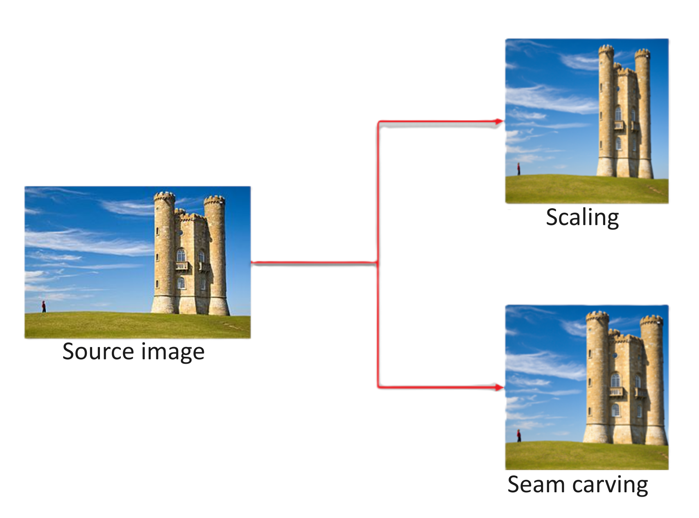
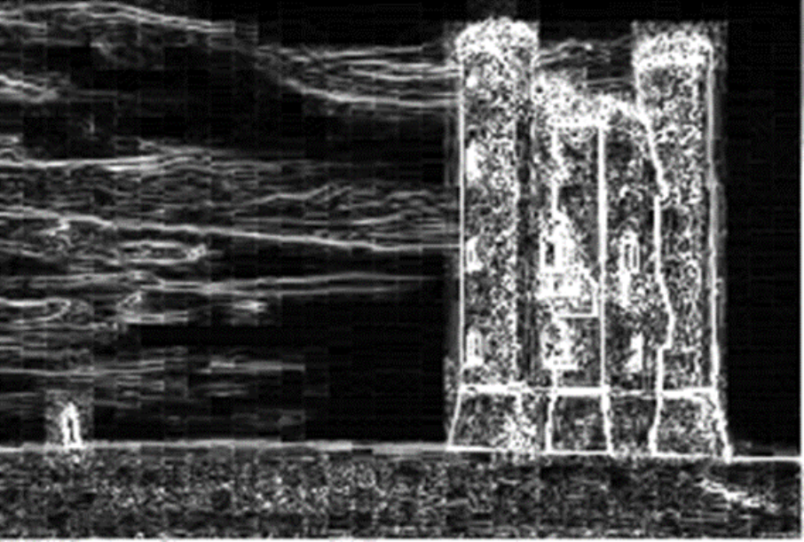
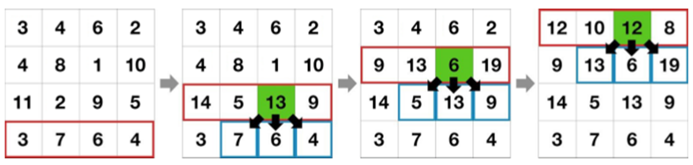
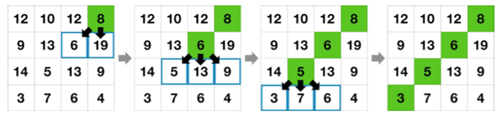
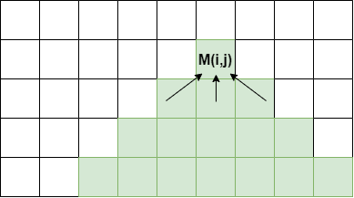
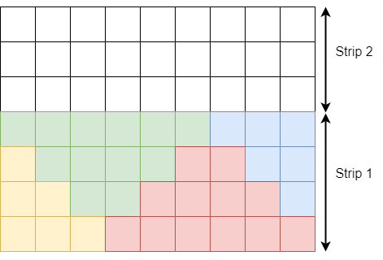

# Parallel Seam Carving using OpenMP

**Authors:** Uroš Lotrič, Davor Sluga  
**Date:** March 2026

## Seam Carving

Seam Carving [[1]](#references) is an image resizing algorithm that dynamically adjusts the dimensions of an image while preserving its essential content. Unlike traditional resizing methods that often distort or crop important parts of an image, Seam Carving identifies and removes the least important pixels in an image along paths of least energy, called seams.

Seam Carving is a three-step process:

**1.** Assign an energy value to every pixel. This defines the important parts of the image we want to preserve.
**2.** Find an 8-connected path of pixels with the least energy. Dynamic programming is used to calculate the costs of every potential path through the image.
**3.** Follow the cheapest path to remove one pixel from each row or column to resize the image.

Following these steps shrinks the image by one pixel. The process is repeated iteratively until the image reaches the desired dimensions. Overall, Seam Carving provides a more flexible and context-aware approach to image resizing than traditional methods like scaling or cropping.

### Details of each step of the algorithm

**Energy Calculation:** The algorithm begins by calculating the energy of each pixel in the image. Energy represents the importance of a pixel based on its contrast with neighboring pixels. Various measures can be used to compute energy, such as the L1/L2 norm of the gradient, saliency, Harris corners, eye gaze, entropy, and histogram of gradients. Here, we will use the Sobel filter, which computes the gradient in the image.

An image gradient highlights parts of the original image that change the most. Large uniform areas have low gradient (energy), while edges and detailed areas have high energy.

If the input image pixel at row $i$ and column $j$ is denoted by $s(i,j)$, then the energy $E(i,j)$ is computed using Sobel as:

$$
G_x = -s(i-1,j-1)-2s(i,j-1)-s(i+1,j-1)
+s(i-1,j+1)+2s(i,j+1)+s(i+1,j+1)
$$

$$
G_y = +s(i-1,j-1)+2s(i-1,j)+s(i-1,j+1)
-s(i+1,j-1)-2s(i+1,j)-s(i+1,j+1)
$$

$$
E(i,j)=\sqrt{G_x^2+G_y^2}
$$

When calculating energy:

1. For input points outside the image, use the value of the closest pixel.
2. For RGB images, compute energy per channel and use the average as the final value.

**Vertical Seam Identification:** After computing the energy map, the algorithm identifies the optimal seam(s) to remove. A seam is a top-to-bottom path with the lowest total energy. Dynamic programming computes the total energy efficiently.

Starting from the bottom row and moving up, each element is set to its energy plus the minimum among the three reachable pixels below (down-left, down, down-right). The cumulative minimum energy is:

$$
M(i,j) = E(i,j) + \min\left(M(i+1, j-1), M(i+1, j), M(i+1, j+1)\right)
$$

**Vertical Seam Removal:** In the final step, remove all pixels along the vertical seam with lowest cumulative energy. Start from the minimum $M$ in the top row and proceed downward, each time selecting the least costly adjacent pixel. Once seam pixels are known, copy remaining pixels on the seam’s right side one position to the left, reducing width.

## Parallel Seam Carving

Each Seam Carving step can be parallelized to different degrees. Individual steps that depend on each other, must still run sequentially one after another. The goal is to maximize the number of operations that can be done in parallel and keeping the total amount of operations as close to the sequential version as possible. Naive approaches to parallelization that increase both, often result in higher execution times.

**Parallel Energy Calculation:** This step is embarrassingly parallel because each pixel’s energy can be computed independently. Work should be evenly distributed among threads. To reduce cache misses, assign contiguous memory regions to each thread.

**Parallel Cumulative Energy Calculation:** Work within a row is independent and can be parallelized, but rows depend on previous rows, which limits parallelism. A basic approach is to split each row among threads and synchronize after each row.

In practice, this can be inefficient [[2]](#references): image widths are often only a few thousand pixels, and each pixel operation is cheap, so synchronization overhead can dominate.

A better partitioning method uses dependency triangles. The image is split into strips. Each strip is filled with up-pointing triangles (no overlap), and leftover areas form down-pointing triangles. Compute all up-pointing triangles in parallel, synchronize, then compute down-pointing triangles, and continue to the next strip.

This reduces synchronization frequency but still has issues:

- Cache use may be suboptimal due to multi-row traversal in triangles.
- Barrier overhead can remain high (two barriers per strip).

One possible improvement is allowing triangle overlap to reduce synchronization points at the cost of a small amount of duplicated work.

**Parallel Seam Removal:** Finding the seam is mostly sequential because the path is traced top-to-bottom with local dependencies. After seam indices are known, copying pixels can be parallelized.

A greedy variant can remove multiple seams in parallel, but this is approximate and can produce overlapping seams unless constrained.

## Assignment

Implement sequential and parallel versions of Seam Carving using C/C++ and OpenMP. The algorithm should handle color images of arbitrary size and arbitrary width reduction. Pass the input image and number of pixels to remove via command-line arguments. You can use the [STB library](https://github.com/nothings/stb) for image I/O. Mesure the performance of your solution on the Arnes cluster.

### Basic tasks (grades 6–8)

- Parallelize all algorithm steps with OpenMP. For cumulative energy, use the basic parallel approach. For seam removal, parallelize only the copying part.
- Compile with optimizations enabled (e.g., `-O3`).
- Measure execution times for image sizes: `720x480`, `1024x768`, `1920x1200`, `3840x2160`, `7680x4320`. A [test image suite](src/test_images/) is provided in the repository. Experiment with the number of threads used (e.g. 1, 2, 4, 8, 16, 32). Be careful when submitting jobs to the cluster. Hyperthreading can affect execution times. See [sample job submission script](src/sample_code/run_sample.sh) for guidance.
- Run the algorithm multiple times (at least 5), each time removing `128` seams, and average timings.
- Compute speed-up $S=t_s/t_p$, where $t_s$ is sequential runtime and $t_p$ is parallel runtime.
- Write a short report (1–2 pages) summarizing the solution and measurements on the cluster, with focus on timings and speed-ups. Try to emphasize what improves performance and what does not, where the bottlenecks are, and whether the behaviour is expected. Support your findings with measurements. 
- Submit your code and report through ucilnica by the deadline (**24. 3. 2026**) and defend it during the labs in the same week.

### Possible bonus tasks (grades 9–10)

- Implement greedy seam removal where multiple seams are removed in parallel; compare runtime and image quality.
- For each image size and each algorithm step, experiment with thread/core counts and determine the best setup. Create a heuristic which, during execution, configures the optimal number of threads for each algorithm step based on image size.
- Implement the improved triangle-based cumulative energy approach and compare it to the basic approach.
- Perform additional optimizations where you see fit and improve your solution; compare optimized vs non-optimized execution times. It is important to demonstrate that your approach is better.

## References

1. Shai Avidan and Ariel Shamir. *Seam Carving for content-aware image resizing*. ACM SIGGRAPH 2007. https://doi.org/10.1145/1275808.1276390  
2. https://shwestrick.github.io/2020/07/29/seam-carve.html
