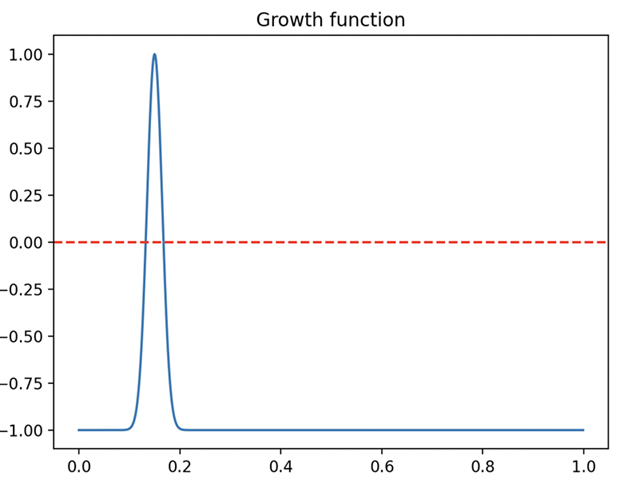
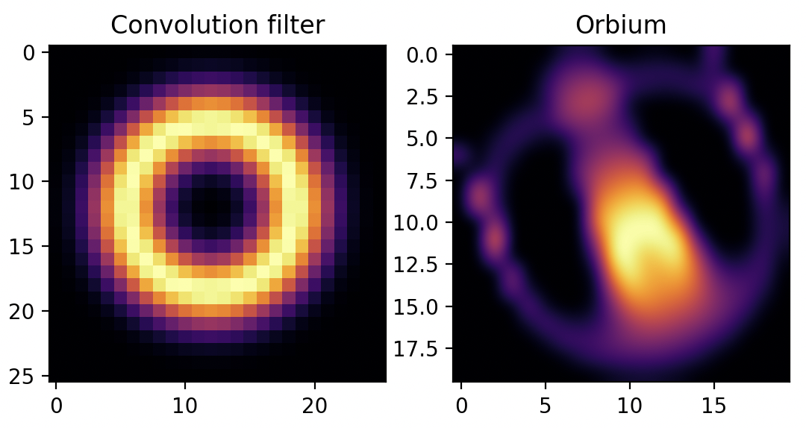
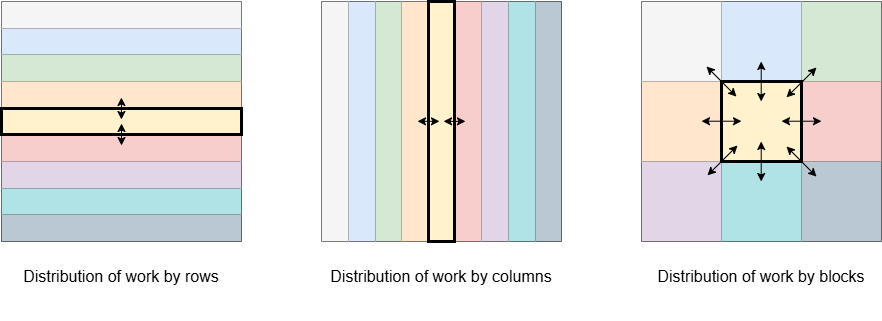

# Assignment 4: Lenia — An Artificial Life

**Authors:** Uroš Lotrič, Davor Sluga  
**Date:** May 2026

## Introduction

The [Lenia project](https://content.wolfram.com/sites/13/2019/10/28-3-1.pdf) started by experimenting with [Game of Life](https://en.wikipedia.org/wiki/Conway%27s_Game_of_Life) variations. It is a generalisation of the Game of Life with continuous space, time, and states. As a consequence, it enables the generation of more complex autonomous creatures. The Game of Life and the Lenia are cellular automata. A cellular automaton is a grid of cells, each having a particular state at a moment. Cells are repeatedly updated according to a local rule that takes each cell and its neighbours into account.

In the Game of Life, the cells are arranged in a rectangular grid, time runs in discrete steps, and each cell has eight neighbouring cells (radius 1), which can take only discrete values 0 (dead) or 1 (alive). The new state of a cell is determined by its current state and the number of alive neighbouring cells.

In Lenia, the space is continuous, but for computer simulation purposes, it is again arranged in a rectangular grid. However, by creating smaller cells, the simulation becomes more accurate. Similarly, time is continuous but discretised for simulation purposes. The discrete time step can take any value; a smaller value results in a more detailed simulation. Next, the neighbourhood in Lenia is much broader. In our simulation, we will limit the radius to 13. Lastly, the state of a cell is represented by a continuous value bounded to the interval [0, 1]. Instead of simply counting alive neighbouring cells, the Lenia grid is convolved with a 2D ring kernel applied to a square matrix of size 26x26. The convolution result passes through a Gaussian-based growth function that determines cell development.

## Lenia simulation

The following listing shows the core simulation functions written in Python for brevity. You can find the whole Python script [here](src/lenia/python/lenia.py).

``` python
# Gaussian function
def gauss(x, mu, sigma):
    return np.exp(-0.5 * ((x-mu)/sigma)**2)

# Ring convolution kernel construction
def kernel_lenia(R, mu, sigma):
    y, x = np.ogrid[-R:R, -R:R]
    dist = np.sqrt((1+x)**2 + (1+y)**2) / R
    K = gauss(dist, mu, sigma)
    K[dist > 1] = 0
    K = K / np.sum(K)
    return K

# growth criteria
def growth_lenia(C, mu, sigma):
    return -1 + 2 * gauss(C, mu, sigma) 

# Lenia iteration t -> t+dt
def evolve_lenia(world, kernel, mu, sigma, dt):  
    # store result of convolution to a new matrix 
    C = sp.signal.convolve2d(world, kernel, mode='same', boundary='wrap') 
    # update the board 
    world = world + dt * growth_lenia(C, mu, sigma)
    # cell values should remain in interval [0, 1]
    world = np.clip(world, 0, 1)
    return world
```
The function `kernel_lenia` constructs a constant ring kernel. The core function of the simulation is `evolve_lenia`, which we call in every iteration. It first convolves the current state `world` with a kernel, then computes cell development by passing the convolution result `C` to the function `growth_lenia`. The visualisation of the growth function is shown below.



Below, we can see the ring kernel and Orbium creature you can use in the simulation. If you place the orbium creature at the start into the world grid, it will keep its shape while it moves around as seen in the provided animation. For other exciting kernels and creatures, consult the [Lenia web page](https://chakazul.github.io/lenia.html).




## Parallel Lenia simulation

Although it is interesting to quest for new creatures and observe their development through time, this should not be your focus. The problem is also interesting from a parallelisation and code optimisation perspective. The evolution of Lenia cellular automata over time can be easily parallelised. In each iteration, each cell's state can be computed independently, and thus in parallel, based on the values of the neighbouring cells from the previous iteration. Of course, there exists a dependence between iterations, so all of the computations in the previous iteration need to finish before we proceed to the next iteration.

Implementing the Lenia simulation on distributed-memory systems using libraries such as MPI involves distributing the workload and exchanging data between cooperating processes to update the grid values. This communication creates additional overhead that needs to be managed effectively. 

There are multiple ways to distribute work between the processes. This affects the number of messages and the amount of data exchanged per iteration.



The above image shows different ways to distribute work among 9 processes and the associated communication patterns. In theory, row and column-wise splits are equivalent, but the column-wise split is less desirable due to inefficient use of CPU cache, so it should not be used in practice. Distribution of work by blocks is a double-edged sword. Using it reduces the amount of data exchanged among processes per iteration, and this becomes quite noticeable for many processes. In theory, this should make the algorithm more scalable. The downside is that the number of messages exchanged per iteration increases by a factor of 4, which can cause considerable overhead and potentially nullify the benefits.

## Assignment

Implement a parallel Lenia simulation in C/C++ using MPI that evolves the initial world for a given number of iterations on a distributed system and outputs the final grid state. You can start from the provided [sequential C code](src/lenia/), which already includes examples of build and run scripts to use MPI, as well as the initialisation code for the grid to produce moving orbiums. The code also includes optional code to generate animations, which you can use to examine the results. 

### Code organization
- `Makefile` -> Project build rules.
- `run_lenia.sh` -> Sbatch script to acquire resources on the Arnes cluster, build and run the Lenia simulator.
- `src/`
    - `main.c` -> Main project file.
    - `lenia.c` -> Lenia simulation code.
    - `orbium.c` -> Code for placement of [Orbium creatures](https://ar5iv.labs.arxiv.org/html/2005.03742/assets/fig3a1.png).
    - `gifenc.c` -> Code for generating gif animations; taken from [here](https://github.com/lecram/gifenc).


**Basic tasks (for grades 6-8):**

- Parallelize the algorithm with MPI and use row-wise work distribution.
- Measure the execution time of the algorithm for different grid sizes and number of cores. Use the following grid sizes: 128x128, 512x512, 1024x1024, 2048x2048, 4096x4096, on 1, 2, 4, 16, and 32 cores. Run the algorithm multiple times and average the time measurements to obtain representative results. Benchmark the algorithm on 100 simulation steps.
- Compute the speed-up $S=t_s/t_p$ of your algorithm; $t_s$ is the execution time of the sequential algorithm, and $t_p$ is the execution time of the parallel algorithm.
- Support the option of generating the animation. Use collectives to gather results at the root process, which then generates the GIF.
- Write a short report (1-2 pages) summarising your solution and presenting the measurements performed on the cluster. The main focus should be presenting and explaining the time measurements and speed-ups.
- Hand in your code and the report to ucilnica through the appropriate form by the specified deadline (**26. 5. 2026**) and defend your code and report during labs in the same week.

**Bonus tasks (for grades 9-10):**

- Use the block-wise distribution of work in the parallel algorithm and compare the execution times to the row-wise distribution.
- Compare the execution times when running the processes on one or two nodes for the same number of processes and cores.
- Use MPI derived data types to facilitate communication between processes.
- Try to reduce communication overhead by doing more computation. Increasing the width of the border area, which is exchanged between processes, and performing additional computations on the border enables you to exchange data only every second, third, etc. iteration.
- Perform additional optimizations of the algorithm where you see fit. Compare the non-optimized algorithm to the optimized algorithm in terms of execution time.
